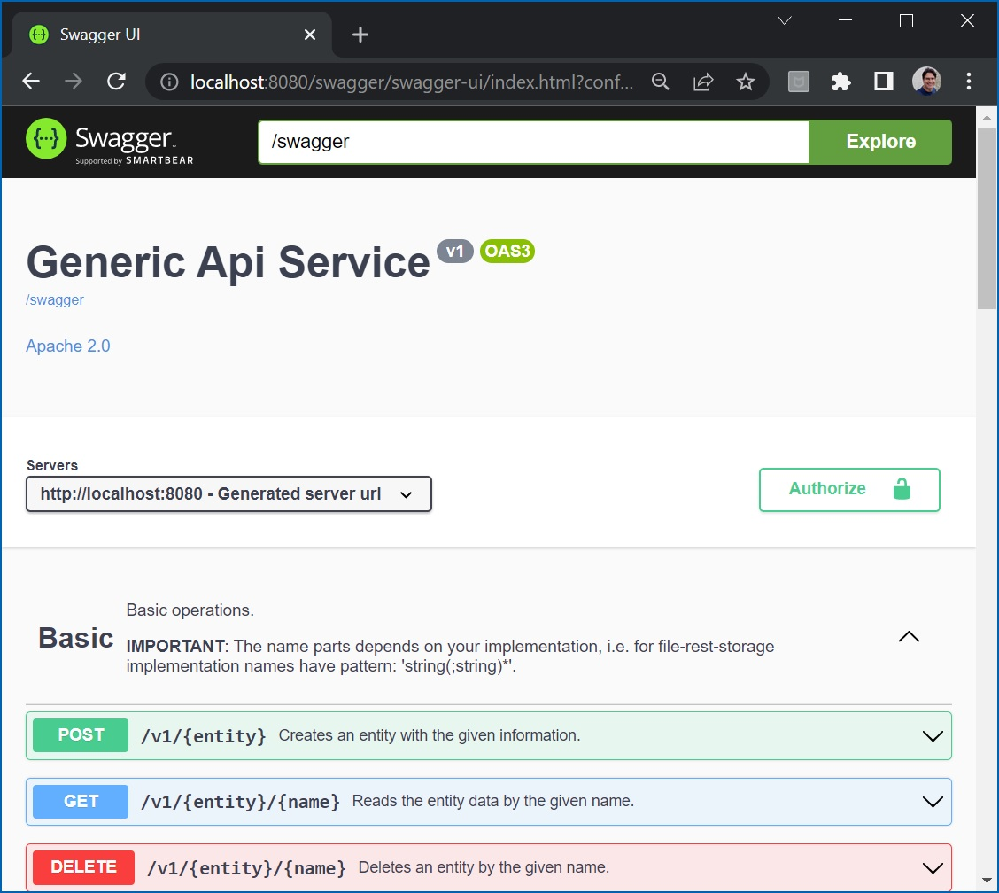

# file-rest-storage

[](https://github.com/thiagolvlsantos/file-rest-storage/actions/workflows/maven.yml)
[](https://github.com/thiagolvlsantos/file-rest-storage/actions/workflows/codeql.yml)
[](https://github.com/thiagolvlsantos/file-rest-storage/actions/workflows/sonar.yml)
[](https://sonarcloud.io/dashboard?id=thiagolvlsantos_file-rest-storage)
[](https://sonarcloud.io/dashboard?id=thiagolvlsantos_file-rest-storage)
[](https://repo1.maven.org/maven2/io/github/thiagolvlsantos/file-rest-storage/)
[](http://www.apache.org/licenses/LICENSE-2.0)

A generic endpoint for versioned entities stored in Git repositories using git-transactions and file-storage.

## Usage

Include latest version [](https://repo1.maven.org/maven2/io/github/thiagolvlsantos/file-rest-storage/) to your project.

```xml
		<dependency>
			<groupId>io.github.thiagolvlsantos</groupId>
			<artifactId>file-rest-storage</artifactId>
			<version>${latestVersion}</version>
		</dependency>
```

## Add `@EnableFileRestStorage` to you app.

```java
...
@EnableFileRestStorage
public class Application {
	...main(String[] args) {...}
}
```

## Configuration
Example using YAMLs configuration file.

```yaml
# OpenAPI params, from rest-storage
springdoc:
  api-docs:
    path: /swagger
  swagger-ui:
    path: /swagger/ui
    operationsSorter: alpha # Sorting endpoints alphabetically
    tagsSorter: alpha       # Sorting tags alphabetically

# Git-Transactions properties, from git-transactions
gitt:
  repository:
    # General properties
    user: ${YOUR_USER}
    password: ${YOUR_TOKEN}
    # tags properties
    tags:
      read: data/read/tags
      write: data/write/tags
      remote: https://github.com/thiagolvlsantos/git-example.git
```

## Domain classes

Using `file-storage ` as the backend storage.

### Entities

A example of a class fully annotated with file-storage requirements.

```java
// ...
@Getter
@Setter
@NoArgsConstructor
@AllArgsConstructor
@SuperBuilder
@FileRepo(Tag.REPO)
public class Tag extends FileObjectVersionedAuditable {

	public static final String REPO = "tags";

	@Schema(description = "Tags's name.", example = "openshift", required = true)
	@NotNull
	@NotBlank
	@Size(min = 1)
	@FileKey
	private String name;

	@Schema(description = "Tag's description.", example = "Tag for openshift items.")
	private String description;
}
```

Alias class to be used on creation methods, and referencing in other objects.

```java
@Getter
@Setter
@AllArgsConstructor
@NoArgsConstructor
@SuperBuilder
@FileAliasFor(Tag.class)
public class TagAlias {

	@Schema(description = "Tag`s name.", example = "openshift", required = true)
	@NotNull
	@NotBlank
	@Size(min = 1)
	@FileKey
	private String name;
}
```

### Repository

There is a default implementation for repositories.

```java
//...
import io.github.thiagolvlsantos.file.storage.util.repository.AbstractFileRepository;

@Repository
public class TagRepository extends AbstractFileRepository<Tag> {

	public TagRepository() {
		super(Tag.class);
	}
}
```
### Service

There is a default implementation for services which mix file-storage and git-transactions requirements.

```java
//...
import io.github.thiagolvlsantos.file.rest.storage.service.AbstractService;
import io.github.thiagolvlsantos.file.storage.util.repository.AbstractFileRepository;
import io.github.thiagolvlsantos.git.transactions.GitRepo;

@Service
@GitRepo(Tag.REPO)
public class TagService extends AbstractService<Tag> {

	private @Autowired TagRepository repo;

	@Override
	public AbstractFileRepository<Tag> repository() {
		return repo;
	}
}
```

### Rest Handler

Lastly, there is a handler (`AbstractFileRestHandler`) for default OpenApi endpoints routing based on `{entity}` which in this example its the `Tag.REPO` name itself.

```java
//...
import io.github.thiagolvlsantos.file.rest.storage.rest.AbstractFileRestHandler;

@Component
public class TagRestHandler extends AbstractFileRestHandler<Tag, TagAlias> {

	public TagRestHandler() {
		super(Tag.REPO, Tag.class, TagAlias.class);
	}

	@Override
	protected Tag toInstance(TagAlias alias) {
		return Tag.builder().name(alias.getName()).build();
	}
}
```

## Endpoints

According to this setup, after server start, the OpenApi interface will be available at [http://localhost:8080/swagger](http://localhost:8080/swagger) and Swagger UI at [http://localhost:8080/swagger/ui](http://localhost:8080/swagger/ui).

This is a generic endpoint where if you use `Tag.REPO` ('tags') as a replacement for `{entity}` the `TagRestHandler` will take the action.



## Build

Localy, from this root directory call Maven commands or `bin/<script name>` at your will.
